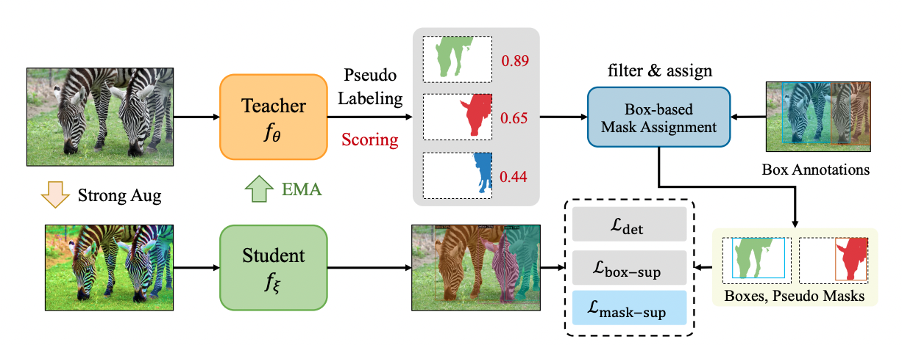

<div align="center">
<h2>BoxTeacher</h2>
<h4>Exploring High-Quality Pseudo Masks for Weakly Supervised Instance Segmentation</h4>
<br>

<a href="https://scholar.google.com/citations?hl=zh-CN&user=PH8rJHYAAAAJ">Tianheng Cheng</a><sup><span>1</span></sup>, <a href="https://xinggangw.info/">Xinggang Wang</a><sup><span>1</span></sup>, <a href="https://scholar.google.com/citations?user=PIeNN2gAAAAJ&hl=zh-CN&oi=ao">Shaoyu Chen</a><sup><span>1</span></sup>, <a href="https://scholar.google.com/citations?user=pCY-bikAAAAJ&hl=zh-CN">Qian Zhang</a><sup><span>2</span></sup>, <a href="http://eic.hust.edu.cn/professor/liuwenyu/"> Wenyu Liu</a><sup><span>1,&#8224;</span></sup>
</br>

<sup>1</sup>  School of EIC, HUST,  <sup>2</sup> Horizon Robotics
<br>
(<span>&#8224;</span>: corresponding author)
<div>
<a href="https://arxiv.org/abs/2210.05174">[arXiv Preprint (Camera Ready)]</a>
</div>
</div>


## Updates 


* `[2023-3-29]` We release code and models of BoxTeacher!
* `[2023-3-2]` BoxTeacher has been accepted by CVPR 2023🎉!  We're preparing the code and models and going to open source in March!
* `[2022-10-12]` We release the initial version of BoxTeacher!


## Highlights


* BoxTeacher presents a novel perspective, *i.e.*, leveraging high-quality masks, to address box-supervised instance segmentation.
* BoxTeacher explores a self-training framework with consistency training, pseudo labeling, and noise-aware losses. It's effective and can largely bridge the gap between fully-supervised methods and box-supervised methods. 
* BoxTeacher is extensible, and can be applied to any instance segmentation approach. We have plans to apply it to other methods, *e.g.,* Mask2Former, but we cannot guarantee the timeline.


## Overview

Labeling objects with pixel-wise segmentation requires a huge amount of human labor compared to bounding boxes. Most existing methods for weakly supervised instance segmentation focus on designing heuristic losses with priors from bounding boxes. While, we find that box-supervised methods can produce some fine segmentation masks and we wonder whether the detectors could learn from these fine masks while ignoring low-quality masks. To answer this question, we present BoxTeacher, an efficient and end-to-end training framework for high-performance weakly supervised instance segmentation, which leverages a sophisticated teacher to generate high-quality masks as pseudo labels. Considering the massive noisy masks hurt the training, we present a mask-aware confidence score to estimate the quality of pseudo masks and propose the noise-aware pixel loss and noise-reduced affinity loss to adaptively optimize the student with pseudo masks.

<div align="center">

<br>
<br>
</div>

## Models

### COCO Instance Segmentation

| Model | Backbone | Schedule | AP | AP<sup>test</sup> | Weights | Log |
| :---- | :------: | :------: |:--:| :---------------: | :-----: | :-: |
| [BoxTeacher](projects/BoxTeacher/configs/coco/boxteacher_r50_1x.yaml) | [R-50](https://github.com/hustvl/BoxTeacher/releases/download/v1.0/R-50.pkl)  | 1x | 32.6 | 32.9 | [ckpts](https://github.com/hustvl/BoxTeacher/releases/download/v1.1/boxteacher_r50_1x.pth) |  [log](https://github.com/hustvl/BoxTeacher/releases/download/v1.1/boxteacher_r50_1x.log)* |
| [BoxTeacher](projects/BoxTeacher/configs/coco/boxteacher_r50_3x.yaml) | [R-50](https://github.com/hustvl/BoxTeacher/releases/download/v1.0/R-50.pkl)  | 3x | 34.9 | 35.0 | [ckpts](https://github.com/hustvl/BoxTeacher/releases/download/v1.1/boxteacher_r50_aug_3x.pth) | [log](https://github.com/hustvl/BoxTeacher/releases/download/v1.1/boxteacher_r50_aug_3x.log)*|
| [BoxTeacher](projects/BoxTeacher/configs/coco/boxteacher_r101_3x.yaml) | [R-101](https://github.com/hustvl/BoxTeacher/releases/download/v1.0/R-101.pkl) | 3x | 36.2 | 36.5 | [ckpts](https://github.com/hustvl/BoxTeacher/releases/download/v1.1/boxteacher_r101_aug_3x.pth) | [log](https://github.com/hustvl/BoxTeacher/releases/download/v1.1/)* |
| [BoxTeacher](projects/BoxTeacher/configs/coco/boxteacher_r101_dcn_3x.yaml) | [R-101-DCN](https://github.com/hustvl/BoxTeacher/releases/download/v1.0/R-101.pkl) | 3x | 37.2 | 37.6 | [ckpts](https://github.com/hustvl/BoxTeacher/releases/download/v1.1/boxteacher_r101_dcn_aug_3x.pth) | - |
| [BoxTeacher](projects/BoxTeacher/configs/coco/boxteacher_swin-base_3x.yaml) | [Swin-B](https://github.com/hustvl/BoxTeacher/releases/download/v1.0/swin_base_patch4_window7_224.pth) | 3x | 40.2 | 40.5 | [ckpts](https://github.com/hustvl/BoxTeacher/releases/download/v1.1/boxteacher_swin_base_aug_3x.pth) | - |

* *: we provide the training log with the re-implemented code.
* we have optimized the color-based pairwise loss (in BoxInst), and now training BoxTeacher (R-50, 1x) requires 20 hours with 8 3090 GPUs.

## Quick start


### Preliminaries

BoxTeacher is mainly developed based on [detectron2](https://github.com/facebookresearch/detectron2) and [Adelaidet](https://github.com/aim-uofa/AdelaiDet).


1. Install dependencies for BoxTeacher.

```bash
# install detectron2
python setup.py build develop

# install adelaidet
cd AdelaiDet
python setup.py build develop
cd ..
```

2. Prepare the datasets for BoxTeacher.

```
boxteacher
datasets/
 - coco/
 - voc/
 - cityscapes/
```
You can refer to [detectron-doc](datasets/README.md) for more details about (custom) datasets.

3. Prepare the pre-trained weights for different backbones.

```bash
mkdir pretrained_models
cd pretrained_models
# download the weights with the links from the above table.
```

### Training

```bash
python train_net.py --config-file <path/to/config> --num-gpus 8
```

### Testing

```bash
python train_net.py --config-file <path/to/config> --num-gpus 8 --eval MODEL.WEIGHTS <path/to/weights>
```


## A simple guide for applying BoxTeacher to other methods

1. create the wrapper class ([BoxTeacher](projects/BoxTeacher/boxteacher/boxteacher.py)).

2. modify the instance segmentation method (e.g., CondInst, Mask2Former) by:

  - adding `forward_teacher()`, which is the inference function to obtain the pseduo masks

  - adding `box-supervised loss` and `pseudo mask loss` to for training.

3. train and evaluate.


## Acknowledgements

BoxTeacher is based on [detectron2](https://github.com/facebookresearch/detectron2) and [Adelaidet](https://github.com/aim-uofa/AdelaiDet) and we sincerely thanks for their code and contribution to the community!


## License

SparseInst is released under the [MIT Licence](LICENCE).


## Citation

If you find BoxTeacher is useful in your research or applications, please consider giving us a star &#127775; and citing BoxTeacher by the following BibTeX entry.

```BibTeX
@inproceedings{Cheng2022BoxTeacher,
  title     =   {BoxTeacher: Exploring High-Quality Pseudo Labels for Weakly Supervised Instance Segmentation},
  author    =   {Cheng, Tianheng and Wang, Xinggang and Chen, Shaoyu and Zhang, Qian and Liu, Wenyu},
  booktitle =   {{IEEE/CVF} Conference on Computer Vision and Pattern Recognition,
               {CVPR} 2022, New Orleans, LA, USA, June 18-24, 2022},
  year      =   {2022}
}

```